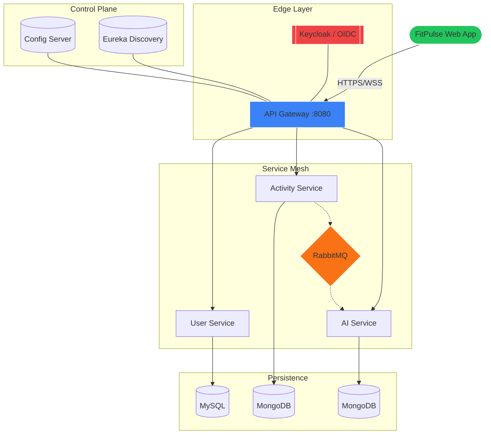

<div align="center">

# 🦾 FitPulseAI
### *Intelligence in Every Rep. Precision in Every Step.*

[](https://react.dev/)
[](https://spring.io/projects/spring-boot)
[](https://microservices.io/)
[](https://opensource.org/licenses/MIT)

---

**FitPulseAI** is not just another tracker—it's a high-performance fitness ecosystem. Built on a cutting-edge **Spring Cloud** microservices backbone and a breathtaking **React 19** "Glassmorphism" interface, it leverages AI to turn your biometric data into a personalized training roadmap.

[Explore Features](#-key-features) • [View Architecture](#-system-design) • [Get Started](#-quick-start)

---
</div>

## 🌟 Key Features

<table width="100%">
  <tr>
    <td width="50%" valign="top">
      <h4>🤖 AI Coaching Engine</h4>
      <p>Receive context-aware recommendations after every session. Our AI analyzes your recovery, intensity, and historical trends to tell you exactly when to push and when to rest.</p>
    </td>
    <td width="50%" valign="top">
      <h4>💎 Glassmorphism UI</h4>
      <p>A premium dark-themed aesthetic with vibrant neon accents, glowing gradients, and fluid animations. Designed for focus and clarity.</p>
    </td>
  </tr>
  <tr>
    <td width="50%" valign="top">
      <h4>📊 Multi-Sport Analytics</h4>
      <p>Deep-dive into 30+ metrics across Running, HIIT, Strength, and more. Visualized through interactive pace charts and intensity heatmaps.</p>
    </td>
    <td width="50%" valign="top">
      <h4>🛡️ Enterprise Security</h4>
      <p>Secured by <b>Keycloak OIDC</b> and Spring Security. Your biometric data is encrypted and isolated within dedicated microservice boundaries.</p>
    </td>
  </tr>
</table>

---

## 🎨 The Activity Ecosystem

FitPulseAI treats every sport with the precision it deserves. Each activity type comes with its own visual identity:

| Activity | Identity | Focus Metric |
| :--- | :--- | :--- |
| **Running** | 🏃 `Emerald` | Pace & Cadence |
| **Cycling** | 🚴 `Amber` | Power & Elevation |
| **Strength** | 🏋️ `Violet` | Volume & Load |
| **HIIT** | ⚡ `Orange` | Peak Heart Rate |
| **Yoga** | 🧘 `Rose` | Mindfulness & Flow |
| **Swimming** | 🏊 `Cyan` | Stroke Efficiency |

---

## 🧠 The AI Brain: How it Works

FitPulseAI follows a 3-step evolution for your fitness:

1.  **Ingestion:** Log your workout via our rapid-entry forms.
2.  **Analysis:** The **Activity Service** broadcasts the data to the **AI Service** via **RabbitMQ**.
3.  **Insight:** The AI computes 4 distinct feedback layers:
    *   **The Verdict:** High-level performance summary.
    *   **The Edge:** Specific tactical improvements.
    *   **The Plan:** Next-session suggestions.
    *   **The Shield:** Safety warnings to prevent burnout.

---

## 🏗️ System Design

Our architecture is designed for infinite scalability and zero-downtime deployments.



---

## 🚀 Quick Start

### 🔧 Prerequisites
*   **Java 26** & **Maven**
*   **Node.js 20+** & **npm**
*   **Docker Desktop** (for infra)

### 📦 Installation
```bash
# Clone the repository
git clone https://github.com/your-repo/fitness-microservice.git

# Spin up infrastructure
docker-compose up -d  # MySQL, MongoDB, RabbitMQ, Keycloak

# Start the Backend (in order)
# 1. Eureka -> 2. Config -> 3. Services -> 4. Gateway

# Start the Frontend
cd fitness-app-frontend
npm install
npm run dev
```

---

<div align="center">
  <h3>Ready to level up?</h3>
  <p>Join 47,000+ athletes training smarter, not harder.</p>
  
  [](https://github.com)
  
  <br>
  
  © 2026 FitPulseAI Ecosystem. *Precision Fitness Architecture.*
</div>
